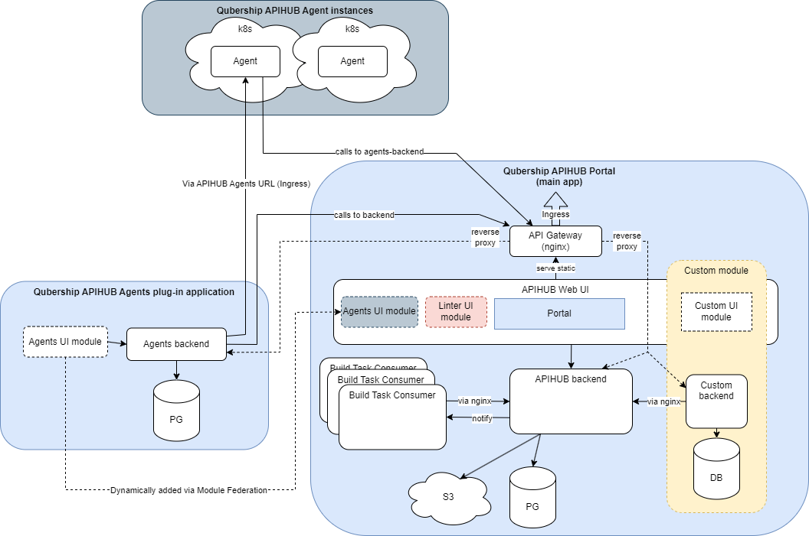

# qubership-apihub-agents-backend

A Go-based microservice backend that provides management and orchestration capabilities for [Qubership APIHUB agent](https://github.com/Netcracker/qubership-apihub-agent) instances.
This service handles agent registration, service discovery, snapshot management, and security checks.

## High Level architecture


## API Documentation

API documentation is available in the [OpenAPI specification](docs/api/Agents-Backend-API.yaml).

## Installation

This service is designed for Kubernetes deployment and uses PostgreSQL as the database.

The service is a plug-in for Qubership-APIHUB and useless without it.

Being an optional plug-in it is included into default Qubership-APIHUB delivery. Please refer to [Qubership-APIHUB Installation Notes (Helm Chart)](https://github.com/Netcracker/qubership-apihub/blob/main/docs/installation-guide.md).

Corresponding [values.yaml](https://github.com/Netcracker/qubership-apihub/blob/main/helm-templates/qubership-apihub/values.yaml) section is `qubershipApihubAgentsBackend`.

Presence of this plug-in in Qubership-APIHUB deployments enables `Agents` tab in Web UI.

## Configuration

Application parameters are loaded from `config.yaml`. The configuration format,
defaults, and examples are documented in [the template file](qubership-apihub-agents-backend/config.template.yaml). For local development,
use that template as a reference and create `qubership-apihub-agents-backend/config.yaml`.

By default, the service looks for `config.yaml` in the current working directory. Set
`AGENTS_BACKEND_CONFIG_FOLDER` to point to a different directory that contains the file.

The remaining environment-only settings are:

- `AGENTS_BACKEND_CONFIG_FOLDER` - directory containing `config.yaml`; defaults to `.`.
- `LOG_LEVEL` - initial log level; defaults to `info` when empty or invalid and can be changed at runtime via `/api/v1/debug/logs/setLevel` by a system administrator.

## Build

Just run `build_golang_binary.cmd` file.

For Docker builds, use `build_docker_image.cmd`.

## AI agent configuration (APM)

Agent context is split between a **central store** and **this repository**:

| Scope | Location |
|-------|----------|
| Generic skills/rules (Go conventions, planner, …) | [`qubership-apihub-ci/agent-packages`](https://github.com/Netcracker/qubership-apihub-ci/tree/apm_migration/agent-packages) |
| Agents-backend-specific packages | [`agent-packages/`](agent-packages/) in this repository |
| Deployed harness output | `.cursor/` and `.claude/` (committed; refresh with APM) |

After changing package sources or `apm.yml`, refresh deployed harness files:

```bash
# one-time: install APM (see https://microsoft.github.io/apm/)
brew install microsoft/apm/apm   # or: pip install apm-cli

# from the repository root:
apm install --target cursor,claude --legacy-skill-paths
```

This reads root `apm.yml` (CI dependencies + local `agent-packages/`), updates
`apm.lock.yaml`, and deploys into `.cursor/` and `.claude/`. Commit the refreshed harness
trees together with package or manifest changes.

During migration, CI dependencies may use `#apm_migration`; drop the suffix after the store PR
merges.
